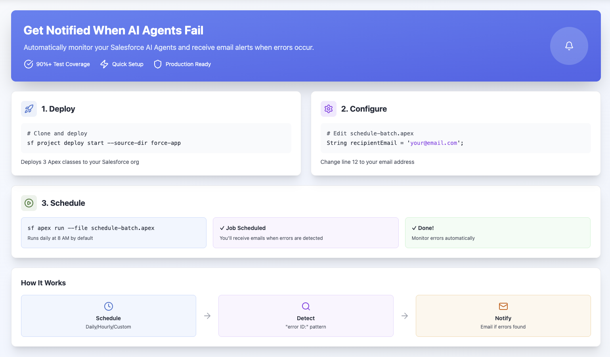
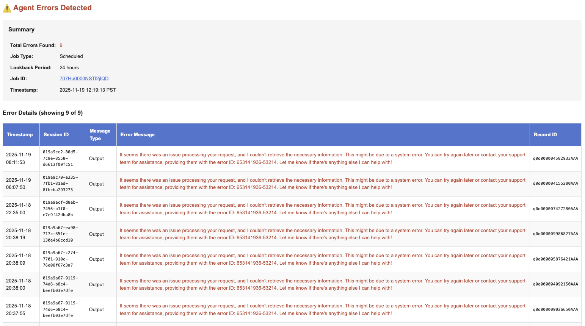
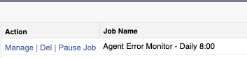

# Agent Error Monitor (v1.3.1)

**Automatically detect and get notified when your Salesforce AI Agents encounter errors.**

This solution monitors AI Agent interactions in Data Cloud and sends you email alerts when errors occur.



**What you get:**

- 📧 Email alerts when AI Agents hit errors
- 🎯 Smart detection (filters out false positives)
- ⏰ Flexible scheduling (daily, hourly, or custom)
- 📊 Detailed error reports with timestamps and session IDs

**Example Email Alert:**



---

## ⚡ Quick Start

**Prerequisites:**

- Salesforce org with Data Cloud and AI Agents enabled
- Salesforce CLI installed ([install guide](https://developer.salesforce.com/tools/salesforcecli))
- Authenticated to your sandbox/org: `sf org login web`

**Setup Steps:**

### 1. Clone and Deploy

```bash
# Clone this repository
git clone <repository-url>
cd agent-error-monitor

# Deploy to your Salesforce org
sf project deploy start --source-dir force-app
```

### 2. Configure Your Email

Open the file `scripts/apex/schedule-batch.apex` in any text editor and change line 12:

```apex
String recipientEmail = 'your-email@example.com';  // ← Change to YOUR email
```

**Optional:** Change the schedule (default is daily at 8 AM):

```apex
// Line 16: Choose schedule type
AgentErrorMonitorScheduler.ScheduleType scheduleType =
    AgentErrorMonitorScheduler.ScheduleType.DAILY;  // DAILY, HOURLY, or INTERVAL

// Line 13: How many hours back to check (default: 24)
Integer lookbackHours = 24;  // Match this to your schedule frequency

// Line 19: For DAILY - what time? (0-23)
Integer dailyHour = 8;  // 8 = 8:00 AM

// Line 22: For INTERVAL - how often? (1-12 hours)
Integer intervalHours = 4;  // Every 4 hours
```

**Common Schedules:**

- **Daily at 8 AM** (default) - No changes needed (`lookbackHours = 24`)
- **Every hour** - Change line 16 to `ScheduleType.HOURLY` and set `lookbackHours = 1`
- **Every 4 hours** - Change line 16 to `ScheduleType.INTERVAL` and set `lookbackHours = 4`

### 3. Schedule the Job

```bash
sf apex run --file scripts/apex/schedule-batch.apex
```

You should see:

```
✓ Batch job scheduled successfully
Schedule: Daily at 8:00
Email Recipient: your-email@example.com
```

### ✅ Done!

The job is now scheduled. You'll receive email alerts when errors are detected.

**Verify it's running:**

- Go to Salesforce Setup → Scheduled Jobs
- Look for "Agent Error Monitor - Daily 8:00"

**Test it immediately (optional):**

```bash
sf apex run --file scripts/apex/run-batch-now.apex
```

### 📸 Scheduled Job

Once configured, your scheduled job will appear in Salesforce Setup → Apex Jobs → Scheduled Jobs:



---

## 📖 Reading Guide

**Where should you start?**

| Your Goal                         | Start Here                                                    |
| --------------------------------- | ------------------------------------------------------------- |
| **Get it working now**            | → [Quick Start](#-quick-start) (above)                        |
| **Understand what it does**       | → [How It Works](#-how-it-works)                              |
| **Deploy to production**          | → [Installation](#-installation) + [Deployment](#-deployment) |
| **Customize the error detection** | → [API Reference](#-api-reference)                            |
| **Fix an issue**                  | → [Troubleshooting](#-troubleshooting)                        |
| **Run tests**                     | → [Testing](#-testing)                                        |

---

## 🎯 Overview

This solution monitors `ssot__AiAgentInteractionMessage__dlm` records in Data Cloud to identify and report errors in AI Agent interactions. It uses intelligent pattern matching to distinguish between actual system errors and user questions about errors, reducing false positives.

### Key Features

- ✅ **Intelligent Error Detection**: Pattern-based error identification focusing on "error ID:" patterns
- ✅ **Email Notifications**: HTML-formatted email alerts with detailed error information
- ✅ **Flexible Scheduling**: Daily, hourly, or custom interval scheduling options
- ✅ **Batch Processing**: Efficient handling of large datasets with configurable batch sizes
- ✅ **Comprehensive Testing**: 90%+ code coverage with robust test classes
- ✅ **Production Ready**: Error handling, logging, and state management built-in
- ✅ **Fail-Fast Error Handling**: Exceptions propagate to Salesforce monitoring for visibility
- ✅ **Configurable Lookback Period**: Customize how far back to check for errors (default: 24 hours)

## 📋 Table of Contents

- [Reading Guide](#-reading-guide)
- [Overview](#-overview)
- [How It Works](#-how-it-works)
- [Installation](#-installation)
- [Configuration](#-configuration)
- [Usage](#-usage)
- [Screenshots](#-screenshots)
- [Testing](#-testing)
- [API Reference](#-api-reference)
- [Deployment](#-deployment)
- [FAQ](#-frequently-asked-questions)
- [Troubleshooting](#-troubleshooting)
- [License](#-license)

## 🏗️ How It Works

### What Gets Monitored

This solution monitors your AI Agent conversations stored in Data Cloud (`ssot__AiAgentInteractionMessage__dlm`). It looks for error messages that indicate something went wrong during an AI Agent interaction.

### What Counts as an Error?

The system detects:

- ✅ Messages with "Error ID:" (the most reliable indicator)
- ✅ System error keywords like "system error occurred"
- ✅ Error codes and failure messages

It **ignores**:

- ❌ User questions about errors (e.g., "How do I fix error messages?")
- ❌ Normal conversation about troubleshooting

### When Does It Run?

You configure the schedule:

- **Daily** at a specific time (e.g., 8 AM)
- **Hourly** on the hour
- **Every N hours** (e.g., every 4 hours)

### What Happens When It Runs?

1. **Checks configurable time window** of AI Agent messages (default: last 24 hours)
2. **Finds errors** using pattern matching
3. **Sends one email** if any errors are found (up to 100 errors shown)
4. **Sends nothing** if no errors (no spam!)

### What's in the Email?

- Total error count
- Execution time and timestamp
- Timestamp of each error
- Session ID (to trace the conversation)
- Message type (User/Agent/System)
- Error message text
- Record ID for each error
- Link to the batch job in Salesforce

---

## 🚀 Installation

### Prerequisites

#### **Required Components**

- Salesforce org with Data Cloud enabled
- AI Agent configured and active
- Email deliverability configured in Salesforce

#### **Minimum Required Permissions**

The user deploying and running this solution needs:

**System Permissions:**

- ✅ **API Enabled** - Required for Salesforce CLI deployment
- ✅ **View All Data** - Required to query `ssot__AiAgentInteractionMessage__dlm` in Data Cloud
- ✅ **Modify All Data** - Required to schedule batch jobs via `System.schedule()` or `Database.executeBatch()`
- ✅ **Author Apex** - Required to deploy Apex classes (not required to run them)
- ✅ **View Setup and Configuration** - Required to view scheduled jobs in Setup

**Object Permissions:**

- ✅ **Read** access to `ssot__AiAgentInteractionMessage__dlm` (Data Cloud AI Agent Interaction Message)
- ✅ **Read** access to `AsyncApexJob` (for monitoring batch jobs)
- ✅ **Read** access to `CronTrigger` (for managing scheduled jobs)

**Email Permissions:**

- ✅ Email deliverability set to **"All Email"** or **"System email only"** (NOT "No access")
  - Location: Setup → Email Administration → Deliverability
  - Batch Apex emails work with both "All Email" and "System email only"
- ✅ No email sending limits exceeded (5,000 emails per day per org)

**Recommended Permission Sets:**

- **Data Cloud Admin** - Grants comprehensive Data Cloud access
- **System Administrator** - Includes all required permissions

> **Note:** Users can use a custom permission set with only the minimum permissions listed above instead of full admin access, following the Principle of Least Privilege.

### Deployment Steps

1. **Clone the repository**

   ```bash
   git clone <repository-url>
   cd agent-error-monitor
   ```

2. **Install dependencies**

   ```bash
   pnpm install
   ```

3. **Authenticate with your Salesforce org**

   ```bash
   sf org login web --alias myorg
   ```

4. **Deploy to Salesforce**

   ```bash
   sf project deploy start --source-dir force-app
   ```

5. **Run tests to verify deployment**
   ```bash
   sf apex run test --test-level RunLocalTests --code-coverage --result-format human
   ```

## ⚙️ Configuration

All configuration is done in the scheduling scripts (`scripts/apex/schedule-batch.apex`):

- **Email Recipient**: Change `recipientEmail` variable
- **Batch Size**: Default 200 (adjust for high volume)
- **Lookback Hours**: Configurable time window to check for errors (default: 24 hours)
  - Should match your schedule frequency to avoid gaps or duplicates
  - Example: Daily schedule → 24 hours, Hourly schedule → 1 hour
- **Schedule Type**: DAILY, HOURLY, or INTERVAL

## 📖 Usage

### Which Option Should I Use?

```
┌─────────────────────────────────────────────────────────────┐
│  Need to test or run once?                                  │
│  → Use Option 1: Run Immediately                            │
│                                                              │
│  Need automated monitoring?                                 │
│  → Use Option 2: Schedule for Recurring Execution           │
│                                                              │
│  Need custom scheduling logic?                              │
│  → Use Option 3: Programmatic Scheduling                    │
└─────────────────────────────────────────────────────────────┘
```

---

### Option 1: Run Immediately (Ad-hoc) 🚀

**Use this for**: Testing, one-time runs, or immediate error checks

#### Step 1: Edit the Script

Open `scripts/apex/run-batch-now.apex` and update the configuration:

```apex
// BEFORE (lines 7-8):
String recipientEmail = 'your-email@example.com'; // TODO: Update this email address
Integer lookbackHours = 24; // How many hours back to check for errors

// AFTER:
String recipientEmail = 'admin@yourcompany.com'; // ← Your actual email
Integer lookbackHours = 24; // ← Adjust if needed (default: 24 hours)
```

**Lookback Hours Examples:**

- `24` - Check last 24 hours (default)
- `48` - Check last 2 days
- `72` - Check last 3 days
- `1` - Check last hour only

#### Step 2: Run the Script

```bash
sf apex run --file scripts/apex/run-batch-now.apex
```

#### Step 3: Check the Output

You should see:

```
Batch job started with ID: 707xx0000000001
Processing AI Agent errors from the last 24 hours
Email notifications will be sent to: admin@yourcompany.com
```

#### Step 4: Wait for Email

- If errors are found: You'll receive an email shortly
- If no errors: No email is sent (this is normal!)

---

### Option 2: Schedule for Recurring Execution ⏰

**Use this for**: Automated daily/hourly monitoring in production

#### Step 1: Edit the Schedule Script

Open `scripts/apex/schedule-batch.apex` and configure:

```apex
// ═══════════════════════════════════════════════════════════════════════════════
// CONFIGURATION - Update these values
// ═══════════════════════════════════════════════════════════════════════════════

String recipientEmail = 'admin@yourcompany.com'; // ← YOUR EMAIL HERE
Integer batchSize = 200; // Leave as-is unless you have high volume
Integer lookbackHours = 24; // ← How many hours back to check (should match schedule frequency)

// Choose ONE schedule type:
AgentErrorMonitorScheduler.ScheduleType scheduleType =
    AgentErrorMonitorScheduler.ScheduleType.DAILY;  // ← DAILY, HOURLY, or INTERVAL

// For DAILY schedule: What time should it run?
Integer dailyHour = 8;  // ← 8 = 8:00 AM (use 0-23)

// For INTERVAL schedule: How often should it run?
Integer intervalHours = 4;  // ← Every 4 hours (use 1-12)
```

**Lookback Hours Best Practices:**

- **Daily schedule** → `lookbackHours = 24` (matches 24-hour frequency)
- **Hourly schedule** → `lookbackHours = 1` (matches 1-hour frequency)
- **Every 4 hours** → `lookbackHours = 4` (matches 4-hour frequency)
- **Custom needs** → Adjust as needed (e.g., 48 hours for twice-daily checks)

**Common Schedule Examples:**

| Schedule Type     | Configuration                                    | When It Runs                       |
| ----------------- | ------------------------------------------------ | ---------------------------------- |
| **Daily at 8 AM** | `scheduleType = DAILY`<br>`dailyHour = 8`        | Every day at 8:00 AM               |
| **Daily at 6 PM** | `scheduleType = DAILY`<br>`dailyHour = 18`       | Every day at 6:00 PM               |
| **Every Hour**    | `scheduleType = HOURLY`                          | Every hour on the hour             |
| **Every 4 Hours** | `scheduleType = INTERVAL`<br>`intervalHours = 4` | Every 4 hours starting at midnight |

#### Step 2: Run the Schedule Script

```bash
sf apex run --file scripts/apex/schedule-batch.apex
```

#### Step 3: Verify Scheduling

You should see output like:

```
═══════════════════════════════════════════════════════════════
✓ Batch job scheduled successfully
═══════════════════════════════════════════════════════════════
Job ID: 08exx0000000001
Schedule: Daily at 8:00
Batch Size: 200
Email Recipient: admin@yourcompany.com
═══════════════════════════════════════════════════════════════

Currently scheduled jobs: 1
  • Job: Agent Error Monitor - Daily 8:00
    Next Run: 2025-11-16 08:00:00
    Cron Expression: 0 0 8 * * ?
    State: WAITING
```

#### Step 4: Monitor in Salesforce

Navigate to: **Setup → Scheduled Jobs** to see your scheduled job.

---

### Option 3: Programmatic Scheduling 💻

**Use this for**: Custom scheduling logic or integration with other automation

Run these commands in **Developer Console → Debug → Open Execute Anonymous Window**:

#### Schedule Daily at Specific Time

```apex
// Schedule to run every day at 8 AM
String jobId = AgentErrorMonitorScheduler.scheduleDaily('admin@example.com', 8);
System.debug('Scheduled job ID: ' + jobId);
```

#### Schedule Hourly

```apex
// Schedule to run every hour
String jobId = AgentErrorMonitorScheduler.scheduleHourly('admin@example.com');
System.debug('Scheduled job ID: ' + jobId);
```

#### Schedule Every N Hours

```apex
// Schedule to run every 4 hours
String jobId = AgentErrorMonitorScheduler.scheduleEveryNHours('admin@example.com', 4);
System.debug('Scheduled job ID: ' + jobId);
```

#### Advanced: Full Control

```apex
// Complete control over all parameters
String jobId = AgentErrorMonitorScheduler.schedule(
    'admin@example.com',                           // Email recipient
    AgentErrorMonitorScheduler.ScheduleType.DAILY, // Schedule type
    8,                                             // Daily hour (for DAILY)
    null,                                          // Interval hours (not used for DAILY)
    200,                                           // Batch size
    24                                             // Lookback hours
);
System.debug('Scheduled job ID: ' + jobId);
```

#### Run Batch with Custom Lookback

```apex
// Run batch immediately with custom lookback period
AgentErrorMonitorBatch batch = new AgentErrorMonitorBatch('admin@example.com', 48); // 48 hours
Id jobId = Database.executeBatch(batch, 200);
System.debug('Batch job ID: ' + jobId);
```

---

### Managing Scheduled Jobs 🔧

#### View All Scheduled Jobs

**Option A: Using Apex**

```apex
List<CronTrigger> jobs = AgentErrorMonitorScheduler.getScheduledJobs();
for (CronTrigger job : jobs) {
    System.debug('Job: ' + job.CronJobDetail.Name);
    System.debug('Next Run: ' + job.NextFireTime);
    System.debug('Cron Expression: ' + job.CronExpression);
}
```

**Option B: Using Salesforce UI**

1. Navigate to **Setup**
2. Search for **Scheduled Jobs**
3. Look for jobs named "Agent Error Monitor"

#### Unschedule All Jobs

```apex
// Remove all Agent Error Monitor scheduled jobs
AgentErrorMonitorScheduler.unscheduleAll();
System.debug('All jobs unscheduled');
```

Or manually in Salesforce:

1. Go to **Setup → Scheduled Jobs**
2. Find "Agent Error Monitor" jobs
3. Click **Del** next to each job

---

### 📬 What Happens Next?

After scheduling, here's the workflow:

```
┌─────────────────────────────────────────────────────────────────┐
│                                                                 │
│  1. ⏰ Scheduled Time Arrives                                   │
│     └─→ Batch job starts automatically                         │
│                                                                 │
│  2. 🔍 Scan AI Agent Messages                                   │
│     └─→ Looks back 24 hours for error patterns                 │
│                                                                 │
│  3. 🎯 Detect Errors                                            │
│     └─→ Identifies "error ID:" and system error messages       │
│                                                                 │
│  4. 📧 Send Email (if errors found)                             │
│     └─→ HTML email with error details sent to recipient        │
│                                                                 │
│  5. ✅ Complete                                                  │
│     └─→ Wait for next scheduled run                            │
│                                                                 │
└─────────────────────────────────────────────────────────────────┘
```

**Email Example:**

When errors are detected, you'll receive an email like this:

```
Subject: Agent Errors Detected - 2025-11-16 08:00:00

⚠️ Agent Errors Detected

Summary
─────────────────────────────────────
Total Errors Found:    5
Execution Time:        12 seconds
Job ID:                707xx0000000001
Timestamp:             2025-11-16 08:00:12 PST

Error Details (showing 5 of 5)
─────────────────────────────────────
Timestamp           | Session ID  | Error Message
2025-11-16 07:45:23 | a1B2c3D4e5F | Error ID: 123456789 - Connection timeout
2025-11-16 07:32:15 | g6H7i8J9k0L | System error occurred during processing
...
```

## 📸 Screenshots

### Scheduled Job Management

Once deployed and configured, your Agent Error Monitor will appear in Salesforce's scheduled jobs interface:


**Job Details:**

- **Job Name:** Agent Error Monitor - Daily 8:00
- **Status:** Active and waiting for next execution
- **Actions:** Manage, Delete, or Pause the scheduled job
- **Location:** Setup → Apex Jobs → Scheduled Jobs

### Email Notification Example

Email notifications are sent automatically when errors are detected, featuring:

- Professional HTML formatting
- Detailed error table with timestamps, session IDs, message types, and error text
- Summary statistics (total errors, execution time)
- Link to the batch job in Salesforce

See the example email at the top of this README.

## 🧪 Testing

### Code Coverage

This project includes **comprehensive test coverage** (above 90%+):

| Test Class                     | Coverage | Tests | Status |
| ------------------------------ | -------- | ----- | ------ |
| **AgentErrorMonitorBatch**     | 100%     | 9     | ✅     |
| **AgentErrorMonitorScheduler** | 94%      | 25    | ✅     |
| **AgentErrorMonitorService**   | 93%      | 30    | ✅     |

**Latest Test Run:** November 19, 2025  
**Pass Rate:** 100% (64/64 tests passing)

### Run Tests

```bash
# Run all tests with code coverage
sf apex run test --class-names AgentErrorMonitorBatchTest,AgentErrorMonitorSchedulerTest,AgentErrorMonitorServiceTest --result-format human --code-coverage --wait 30

# Run all local tests
sf apex run test --test-level RunLocalTests --code-coverage --result-format human

# Run specific test class
sf apex run test --tests AgentErrorMonitorServiceTest --result-format human
```

### What's Tested

**Service Layer**:

- Query construction and execution
- Error pattern detection (strict and non-strict modes)
- Email notification generation
- HTML escaping (XSS prevention)
- Edge cases (null values, empty lists)

**Batch Processing**:

- Complete batch lifecycle (start → execute → finish)
- Database.Stateful behavior across chunks
- Error handling and exception cases
- Email sending only when errors exist

**Scheduling**:

- Daily, hourly, and interval scheduling
- Cron expression generation
- Job management (list, delete)
- Input validation

### Test in Developer Console

1. Open **Developer Console**
2. Go to **Test → New Run**
3. Select test classes
4. Click **Run**

## 📚 API Reference

### AgentErrorMonitorService

#### Query Methods

```apex
// Query raw sObject records from last N hours
List<sObject> records = AgentErrorMonitorService.queryErrorRecords(24);

// Process records and detect errors
AgentErrorMonitorService.ProcessingResult result = new AgentErrorMonitorService.ProcessingResult();
AgentErrorMonitorService.processRecords(records, result);

// Access error details
System.debug('Total records: ' + result.totalRecords);
System.debug('Error count: ' + result.errorCount);
System.debug('Error records: ' + result.errorRecords);
```

#### Notification Methods

```apex
// Send error notification (with duration)
Boolean sent = AgentErrorMonitorService.sendErrorNotification(
    errors,
    'admin@example.com',
    'jobId123',
    120L  // duration in seconds
);

// Send error notification (without duration)
Boolean sent = AgentErrorMonitorService.sendErrorNotification(
    errors,
    'admin@example.com',
    'jobId123'
);

// Send scheduler error notification
AgentErrorMonitorService.sendSchedulerErrorNotification(
    exception,
    'admin@example.com'
);
```

#### Utility Methods

```apex
// Build error pattern WHERE clause
String whereClause = AgentErrorMonitorService.buildErrorPatternWhereClause();

// Truncate string
String truncated = AgentErrorMonitorService.truncate('long text', 50);

// Escape HTML
String escaped = AgentErrorMonitorService.escapeHtml('<script>alert("xss")</script>');
```

### AgentErrorMonitorBatch

```apex
// Create batch instance (default 24-hour lookback)
AgentErrorMonitorBatch batch = new AgentErrorMonitorBatch('admin@example.com');

// Create batch with custom lookback period
AgentErrorMonitorBatch batch = new AgentErrorMonitorBatch('admin@example.com', 48); // 48 hours

// Execute batch with custom batch size
Id jobId = Database.executeBatch(batch, 200);
```

### AgentErrorMonitorScheduler

```apex
// Schedule daily at specific hour (default 24-hour lookback)
String jobId = AgentErrorMonitorScheduler.scheduleDaily('admin@example.com', 8);

// Schedule hourly (default 24-hour lookback)
String jobId = AgentErrorMonitorScheduler.scheduleHourly('admin@example.com');

// Schedule every N hours (default 24-hour lookback)
String jobId = AgentErrorMonitorScheduler.scheduleEveryNHours('admin@example.com', 4);

// Unified scheduling method with all parameters
String jobId = AgentErrorMonitorScheduler.schedule(
    'admin@example.com',
    AgentErrorMonitorScheduler.ScheduleType.DAILY,
    8,      // dailyHour
    null,   // intervalHours (not used for DAILY)
    200,    // batchSize
    24      // lookbackHours (optional, defaults to 24)
);

// Manage scheduled jobs
List<CronTrigger> jobs = AgentErrorMonitorScheduler.getScheduledJobs();
AgentErrorMonitorScheduler.unscheduleAll();
```

## 🚢 Deployment

### Pre-Deployment Checklist

**Required:**

- [ ] Update email address in `scripts/apex/schedule-batch.apex` (line 12)
- [ ] Verify Data Cloud is enabled and accessible
- [ ] Verify AI Agents are configured and active
- [ ] Check email deliverability: Setup → Email Administration → Deliverability (NOT "No access")
- [ ] Verify user has required permissions (View All Data, Modify All Data, View Setup and Configuration)
- [ ] Verify user has access to the Apex classes (enabled in profile or permission set)
- [ ] Test in sandbox first (never deploy directly to production)

**Optional:**

- [ ] Customize schedule (default: daily at 8 AM)
- [ ] Adjust batch size if high volume (default: 200 works for most orgs)
- [ ] Adjust lookback hours if needed (default: 24 hours)

### Deployment Commands

```bash
# Deploy all metadata
sf project deploy start --source-dir force-app

# Deploy with validation only
sf project deploy start --source-dir force-app --dry-run

# Quick deploy (after validation)
sf project deploy quick --job-id <validation-job-id>

# Deploy specific classes
sf project deploy start --metadata ApexClass:AgentErrorMonitorService
```

### Post-Deployment Steps

1. **Verify Deployment**

   ```bash
   sf apex run test --tests AgentErrorMonitorServiceTest,AgentErrorMonitorBatchTest,AgentErrorMonitorSchedulerTest
   ```

2. **Schedule the Job**

   ```bash
   sf apex run --file scripts/apex/schedule-batch.apex
   ```

3. **Test Email Notifications**
   - Run batch job manually
   - Verify email receipt
   - Check email formatting

## ❓ Frequently Asked Questions

### Q: How often should I schedule the monitoring?

**A:** It depends on your needs:

- **High-traffic production**: Every hour or every 4 hours
- **Standard monitoring**: Daily (recommended)
- **Low-traffic/testing**: Daily or as needed

### Q: Will I get an email if there are no errors?

**A:** No. Emails are only sent when errors are detected. This prevents inbox clutter.

### Q: How far back does it check for errors?

**A:** By default, it looks back 24 hours, but this is **configurable** via the `lookbackHours` parameter.

**Best Practice:** Match the lookback period to your schedule frequency:

- Daily schedule → 24 hours
- Hourly schedule → 1 hour
- Every 4 hours → 4 hours

This ensures you catch all recent errors while avoiding duplicate notifications.

### Q: Can I send emails to multiple recipients?

**A:** Currently, it supports one recipient per job. To notify multiple people:

- Schedule multiple jobs with different email addresses, OR
- Use a distribution list/group email address

### Q: What counts as an "error"?

**A:** The system looks for:

- Messages containing "error ID:" (primary indicator)
- System error keywords like "system error", "error occurred", "error code:"
- It filters out user questions about errors to reduce false positives

### Q: How do I test without waiting for the schedule?

**A:** Use Option 1 (Run Immediately) to test right away:

```bash
sf apex run --file scripts/apex/run-batch-now.apex
```

### Q: Can I change the schedule after it's set up?

**A:** Yes! Just run the schedule script again with new settings. It automatically unschedules old jobs before creating new ones.

---

## 🔧 Troubleshooting

### 🚫 Issue: No Emails Received

**Symptoms**: Job runs successfully but no email arrives

**Possible Causes & Solutions**:

1. **Email Deliverability Not Configured**

   ```
   ✓ Fix: Setup → Email Administration → Deliverability
          Set to "All email" (recommended) or "System email only"

   ✓ Verify: Check current setting:
          Setup → Quick Find → "Deliverability"
          Access Level should NOT be "No access"

   ✓ Note: "System email only" may block notifications
           Use "All email" for production environments
   ```

2. **Email Sending Limits Exceeded**

   ```
   Error: "SINGLE_EMAIL_LIMIT_EXCEEDED" in debug logs

   ✓ Fix: Salesforce limits email sending:
          - 10 emails per execution in test context
          - 5,000 emails per day per org

   ✓ Check: Review email limits:
          Setup → System Overview → Email Usage
   ```

3. **Email in Spam/Junk Folder**

   ```
   ✓ Fix: Check spam folder and mark as "Not Spam"
          Add sender domain to safe senders list
          Whitelist: *@[your-salesforce-domain].salesforce.com
   ```

4. **No Errors Were Found**

   ```
   ✓ This is normal! No email = no errors detected
          Emails are only sent when AI Agent errors are found

   ✓ Test: Run batch manually to verify:
          sf apex run --file scripts/apex/run-batch-now.apex
   ```

5. **Email Address Bouncing**
   ```
   ✓ Fix: Setup → Email Log Files
          Check for bounce messages
          Verify email address is correct
   ```

**Debug Steps**:

```apex
// Test error detection directly
List<sObject> records = AgentErrorMonitorService.queryErrorRecords(24);
AgentErrorMonitorService.ProcessingResult result = new AgentErrorMonitorService.ProcessingResult();
AgentErrorMonitorService.processRecords(records, result);

System.debug('Total records: ' + result.totalRecords);
System.debug('Error count: ' + result.errorCount);

if (result.errorCount == 0) {
    System.debug('No errors found - this is why no email was sent');
}
```

---

### ⚠️ Issue: Batch Job Fails

**Symptoms**: Job shows "Failed" status in Apex Jobs

**Important Note**: This solution uses **fail-fast error handling**. When processing errors occur, the batch job will fail and be marked as "Failed" in Apex Jobs. This is **intentional behavior** to ensure errors are visible and not silently ignored.

**Possible Causes & Solutions**:

1. **Insufficient Permissions**

   ```
   Error: "sObject type 'ssot__AiAgentInteractionMessage__dlm' is not supported"

   ✓ Fix: Verify user has the following permissions:
          - "View All Data" OR "Modify All Data" system permission
          - Data Cloud Admin permission set assigned
          - Read access to ssot__AiAgentInteractionMessage__dlm object

   ✓ Verify: Run this query to test access:
          SELECT COUNT() FROM ssot__AiAgentInteractionMessage__dlm
   ```

2. **Query Timeout**

   ```
   Error: "System.LimitException: Apex CPU time limit exceeded"

   ✓ Fix: Reduce batch size in schedule-batch.apex:
          Integer batchSize = 100; // Instead of 200

   ✓ Alternative: Add LIMIT clause to reduce query scope:
          Modify lookback hours from 24 to 12
   ```

3. **Object Not Available**

   ```
   Error: "Object does not exist" or "Invalid object name"

   ✓ Fix: Ensure Data Cloud is enabled:
          Setup → Data Cloud → Verify provisioning status

   ✓ Verify: AI Agent must be configured and active:
          Setup → Einstein → AI Agent → Check status

   ✓ Check: Data Cloud license is active:
          Setup → Company Information → View licenses
   ```

4. **Processing Errors During Execution**

   ```
   Error: Various exceptions during record processing

   ✓ Behavior: The batch uses fail-fast error handling
                Exceptions are NOT caught - they propagate and fail the job
                This ensures errors are visible in Salesforce monitoring

   ✓ Fix: Review the error details in the failed job:
          Setup → Apex Jobs → Click failed job → View error message

   ✓ Debug: Check Debug Logs for full stack trace and context
            Setup → Debug Logs → View latest log
   ```

**Debug Steps**:

1. Go to **Setup → Apex Jobs**
2. Click on the failed job
3. Review the error message (this will show the actual exception)
4. Check **Debug Logs** for detailed stack trace and context
5. Fix the underlying issue causing the exception
6. Re-run the batch job after fixing the root cause

---

### 🔍 Issue: No Errors Detected (But You Know There Are Errors)

**Symptoms**: Job runs but doesn't find errors you know exist

**Possible Causes & Solutions**:

1. **Errors Outside Lookback Window**

   ```
   ✓ Fix: Errors are older than 24 hours
          Run with custom lookback:

          // In Anonymous Apex - query last 72 hours
          List<sObject> records = AgentErrorMonitorService.queryErrorRecords(72);
          AgentErrorMonitorService.ProcessingResult result = new AgentErrorMonitorService.ProcessingResult();
          AgentErrorMonitorService.processRecords(records, result);
          System.debug('Found ' + result.errorCount + ' errors in last 72 hours');
   ```

2. **Error Pattern Not Matched**

   ```
   ✓ Fix: Check what messages exist in the records:

          List<sObject> records = AgentErrorMonitorService.queryErrorRecords(24);
          for (sObject rec : records) {
              System.debug('Status: ' + rec.get('ssot__AiAgentInteractionMessageStatus__c'));
              System.debug('Content: ' + rec.get('ssot__ContentText__c'));
          }
   ```

3. **Wrong Object Being Queried**
   ```
   ✓ Fix: Verify the object name in your org matches:
          ssot__AiAgentInteractionMessage__dlm
   ```

---

### ⏰ Issue: Scheduled Job Not Running

**Symptoms**: Job appears scheduled but never executes

**Possible Causes & Solutions**:

1. **Job Was Aborted**

   ```
   ✓ Fix: Check job state:

          List<CronTrigger> jobs = AgentErrorMonitorScheduler.getScheduledJobs();
          for (CronTrigger job : jobs) {
              System.debug('State: ' + job.State);
          }

          If state is not "WAITING", reschedule:
          AgentErrorMonitorScheduler.unscheduleAll();
          AgentErrorMonitorScheduler.scheduleDaily('admin@example.com');
   ```

2. **Incorrect Cron Expression**

   ```
   ✓ Fix: Use the provided helper methods instead of manual cron expressions
   ```

3. **Too Many Scheduled Jobs**
   ```
   ✓ Fix: Salesforce limits scheduled Apex jobs
          Remove unused scheduled jobs from Setup → Scheduled Jobs
   ```

**Verification**:

```apex
// Check if job is properly scheduled
List<CronTrigger> jobs = AgentErrorMonitorScheduler.getScheduledJobs();
System.debug('Total scheduled jobs: ' + jobs.size());

for (CronTrigger job : jobs) {
    System.debug('═══════════════════════════════════');
    System.debug('Job Name: ' + job.CronJobDetail.Name);
    System.debug('Next Run: ' + job.NextFireTime);
    System.debug('State: ' + job.State);
    System.debug('Cron: ' + job.CronExpression);
}
```

### Debug Mode

Enable detailed logging:

```apex
// In Anonymous Apex
System.debug(LoggingLevel.DEBUG, 'Testing error detection');

List<sObject> records = AgentErrorMonitorService.queryErrorRecords(24);
AgentErrorMonitorService.ProcessingResult result = new AgentErrorMonitorService.ProcessingResult();
AgentErrorMonitorService.processRecords(records, result);

System.debug('Total records queried: ' + result.totalRecords);
System.debug('Errors found: ' + result.errorCount);

for (AgentErrorMonitorService.ErrorRecord error : result.errorRecords) {
    System.debug('Error: ' + error.errorMessage);
    System.debug('Status: ' + error.status);
}
```

## 📊 Monitoring

### View Batch Job Status

Navigate to: **Setup → Apex Jobs**

### View Scheduled Jobs

Navigate to: **Setup → Scheduled Jobs**

Or use SOQL:

```sql
SELECT Id, CronJobDetail.Name, CronExpression, State, NextFireTime, PreviousFireTime
FROM CronTrigger
WHERE CronJobDetail.Name LIKE 'Agent Error Monitor%'
ORDER BY NextFireTime
```

### Email Notification Format

Email notifications include:

- **Summary**: Total errors, execution time, job ID, timestamp
- **Error Details Table**: Timestamp, Session ID, Message Type, Error Message, Record ID
- **Styling**: Professional HTML formatting with color-coded errors

## 🛠️ Development

### Project Structure

```
agent-error-monitor/
├── force-app/main/default/
│   └── classes/
│       ├── AgentErrorMonitorService.cls
│       ├── AgentErrorMonitorService.cls-meta.xml
│       ├── AgentErrorMonitorServiceTest.cls
│       ├── AgentErrorMonitorServiceTest.cls-meta.xml
│       ├── AgentErrorMonitorBatch.cls
│       ├── AgentErrorMonitorBatch.cls-meta.xml
│       ├── AgentErrorMonitorBatchTest.cls
│       ├── AgentErrorMonitorBatchTest.cls-meta.xml
│       ├── AgentErrorMonitorScheduler.cls
│       ├── AgentErrorMonitorScheduler.cls-meta.xml
│       ├── AgentErrorMonitorSchedulerTest.cls
│       └── AgentErrorMonitorSchedulerTest.cls-meta.xml
├── scripts/apex/
│   ├── run-batch-now.apex
│   └── schedule-batch.apex
├── package.json
├── sfdx-project.json
└── README.md
```

### Code Quality

```bash
# Run linter
pnpm run lint

# Format code
pnpm run prettier

# Verify all (lint + format + test)
pnpm run verify
```

### Contributing

1. Maintain code coverage above 75%
2. Add comprehensive test cases
3. Document all public methods
4. Use meaningful variable names
5. Handle errors gracefully

## 📝 License

MIT License

Copyright (c) 2025 Agent Error Monitor Contributors

Permission is hereby granted, free of charge, to any person obtaining a copy
of this software and associated documentation files (the "Software"), to deal
in the Software without restriction, including without limitation the rights
to use, copy, modify, merge, publish, distribute, sublicense, and/or sell
copies of the Software, and to permit persons to whom the Software is
furnished to do so, subject to the following conditions:

The above copyright notice and this permission notice shall be included in all
copies or substantial portions of the Software.

THE SOFTWARE IS PROVIDED "AS IS", WITHOUT WARRANTY OF ANY KIND, EXPRESS OR
IMPLIED, INCLUDING BUT NOT LIMITED TO THE WARRANTIES OF MERCHANTABILITY,
FITNESS FOR A PARTICULAR PURPOSE AND NONINFRINGEMENT. IN NO EVENT SHALL THE
AUTHORS OR COPYRIGHT HOLDERS BE LIABLE FOR ANY CLAIM, DAMAGES OR OTHER
LIABILITY, WHETHER IN AN ACTION OF CONTRACT, TORT OR OTHERWISE, ARISING FROM,
OUT OF OR IN CONNECTION WITH THE SOFTWARE OR THE USE OR OTHER DEALINGS IN THE
SOFTWARE.

## ⭐ Show Your Support

If this project helps you monitor your AI Agents, please consider:

- ⭐ Starring the repository
- 🐦 Sharing it with the Salesforce community
- 🤝 Contributing improvements or bug fixes

---

**Last Updated**: November 19, 2025
